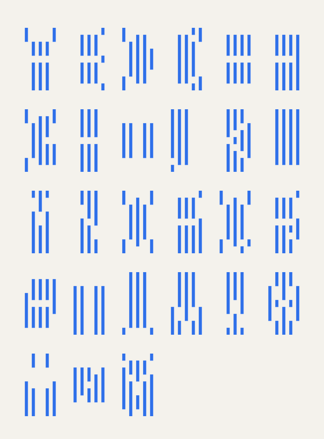
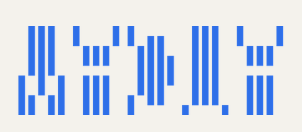
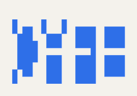
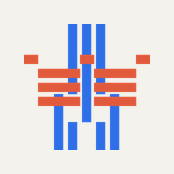
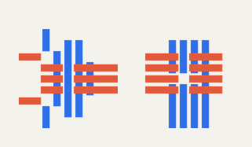

# Vacua

> Experimental modular **negative-space** font. Each letter is drawn by the
> **absence** of vertical strokes on a 5 × 9 grid, never by their presence.

Vacua is a generative **display** font — the glyphs are produced by a
deterministic script, not hand-drawn. The result evokes a barcode or a data
matrix. It belongs to the lineage of modular typefaces (*New Alphabet* by
Wim Crouwel, 1967).

## Full alphabet



## The principle in one picture (ASCII)

Convention: `█` = stroke we **keep** (drawn matter) · `.` = stroke we
**erase** (the void — which forms the letter).

```
   Step 1                Step 2                  Step 3
   ──────                ──────                  ──────
   5 × 9 grid of         pick a letter (E)       what remains is
   vertical strokes      and erase its cells     what gets printed

   │ │ │ │ │             . . . . .               . . . . .
   │ │ │ │ │             . █ █ █ █               . █ █ █ █
   │ │ │ │ │             . █ █ █ █               . █ █ █ █
   │ │ │ │ │     ──►     . █ █ █ █       ──►     . █ █ █ █
   │ │ │ │ │             . . . . .               . . . . .
   │ │ │ │ │             . █ █ █ █               . █ █ █ █
   │ │ │ │ │             . █ █ █ █               . █ █ █ █
   │ │ │ │ │             . █ █ █ █               . █ █ █ █
   │ │ │ │ │             . . . . .               . . . . .

                         the `.` cells trace      look only at the █:
                         the shape of E           the E reads in the gap
```

The trap when adding a glyph: **you don't draw the letter — you draw
everything around it.** Squint at the `█` block above; the `E` is the
missing column-0 and the missing middle band.

## Why it's interesting

- **Absolute coherence**: one algorithm, A → Z by parameters.
- **Trivial 3D output**: straight bars → 3D printing, engraving, CNC.
- **Ambiguous legibility**: E/F/H/L/T very readable, C/O/Q/X cryptic —
  by design, not a bug.
- **Rotation ligatures**: the 2nd letter is the entire glyph rotated 90°,
  read by turning the medium → orientation-based cipher.

## Installation

```bash
python -m venv .venv && source .venv/bin/activate
pip install -e .
```

## Install as a real system font (TTF)

Vacua exports to TTF — installable in macOS, opening to TextEdit, Figma, the
browser, anything.

```bash
mise run install      # generates dist/Vacua-{Regular,Medium,Bold}.ttf
                      # then copies them into ~/Library/Fonts/
```

Other targets:

```bash
mise run font         # build only (no install)
mise run check        # open a browser page that proves the install worked
mise run uninstall    # remove Vacua-*.ttf from ~/Library/Fonts/
mise run clean        # delete dist/ and .venv/
```

After install, **relaunch any app that was already open** (Firefox, TextEdit…) —
they only enumerate system fonts at startup.

### Did it work?

`mise run check` opens `scripts/check-install.html` in your default browser. The
page contains one big sentence styled with `font-family: Vacua`. If you see the
characteristic Vacua barcode-like rendering, the install succeeded. If you see a
plain monospace fallback (with a red warning), the font is not loaded — likely
the app needs a restart.

Manual checks:

```bash
open -a "Font Book" ~/Library/Fonts/Vacua-Regular.ttf   # native macOS viewer
system_profiler SPFontsDataType 2>/dev/null | grep Vacua
```

## Usage — Python

```python
from vacua import render_text, render_chart, BOLD, style_for

img = render_text("VACUA", style=BOLD)
img.save("vacua.png")

render_chart(style=style_for("medium", "solid")).save("chart_solid.png")
```

## Usage — CLI

```bash
python -m vacua "HELLO" --weight bold -o specimen.png
python -m vacua --chart -o chart.png
python -m vacua "A" --ligature --rotate B -o ligature_AB.png
python -m vacua "CAFE" --pairs --weight bold -o cafe_pairs.png   # overlaid pairs: [CA][FE]
python -m vacua "VACUA" --scad -o out/vacua.scad
```

## Usage — OpenSCAD

The `scad/vacua_param.scad` file is **standalone**: the whole alphabet is
encoded in it. Editing the `text` variable regenerates the model.

```bash
# Generate a wrapper that includes vacua_param.scad
python -m vacua "KEYCHAIN" --scad -o scad/keychain.scad
# Open in OpenSCAD, tweak merged/with_keyring/cell/bar_w...
```

See [docs/3d_printing.md](docs/3d_printing.md) for the full list of
parameters.

## Gallery

| | |
|---|---|
|  |  |
|  |  |

## Variants

| Variant | Stroke | Columns | Usage |
|---------|--------|---------|-------|
| Regular | thin | spaced | specimens, charts |
| Medium | medium | spaced | default |
| Bold | thick | spaced | titles |
| Solid | n/a | merged | only the void remains |
| Solid narrow | n/a | merged thin | slender glyphs |
| Thin joined | thin | tight | Regular/Solid compromise |
| Condensed / ultra-condensed | thin | narrow | compact spacing |

## Accepted limitations

Angular letters (E, F, H, I, L, T) read very well. Round ones (C, O, Q) and
diagonals (K, X, Z) are more **suggested** than drawn — this is inherent to
the 5-column resolution and reinforces the cryptic feel.
**Do not try to "fix"** this.

## Tests

```bash
pip install -e ".[dev]"
pytest
```

## Documentation

- [docs/specification.md](docs/specification.md) — the full system
- [docs/pitfalls.md](docs/pitfalls.md) — known pitfalls (the void you fill, 5×9 rotation)
- [docs/3d_printing.md](docs/3d_printing.md) — OpenSCAD → STL pipeline

## Lineage and inspiration

Vacua started as a variant of a system called **Epetri**, then took its own
direction. It draws inspiration from historical modular typefaces — notably
Wim Crouwel's *New Alphabet* (1967) — and from the tradition of generative
typography where the definition fits in a table.

## License

MIT — see [LICENSE](LICENSE).
